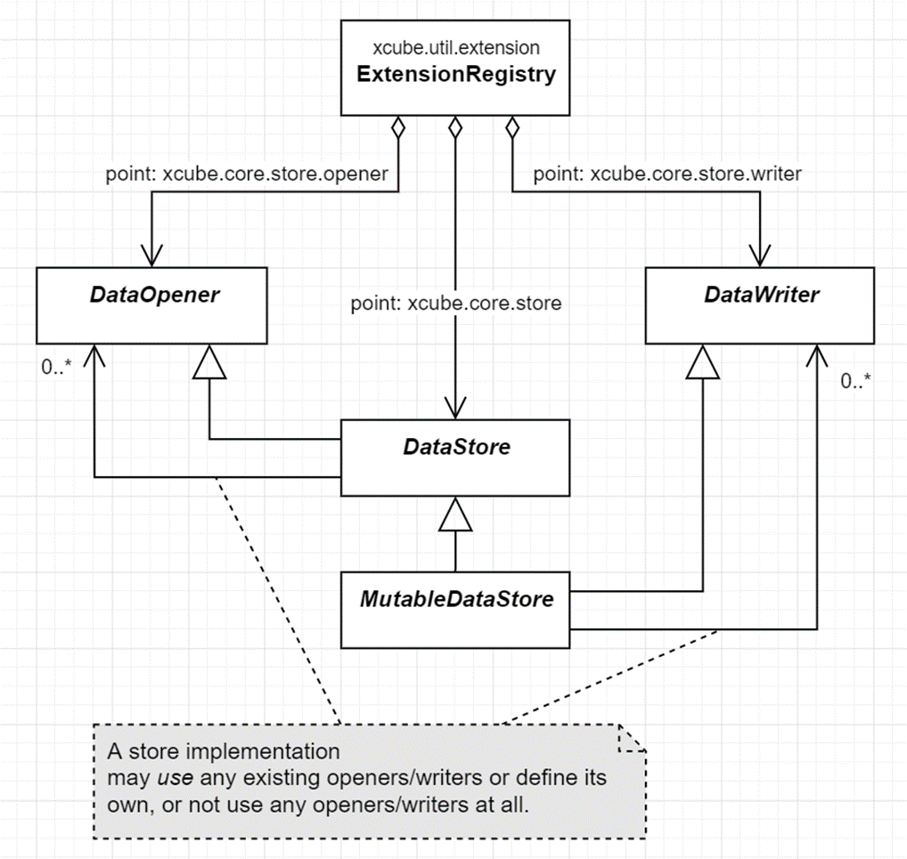

[xcube.core.store]: https://github.com/dcs4cop/xcube/tree/master/xcube/core/store
[xcube Dataset Convention]: ./cubespec.md
[xcube Multi-Level Dataset Convention]: ./mldatasets.md
[xcube Data Store Conventions]: ./storeconv.md
[xarray.Dataset]: https://docs.xarray.dev/en/stable/generated/xarray.Dataset.html
[geopandas.GeoDataFrame]: https://geopandas.org/en/stable/docs/reference/api/geopandas.GeoDataFrame.html
[Dask arrays]: https://docs.dask.org/en/stable/array.html
[JSON Object Schema]: https://json-schema.org/understanding-json-schema/reference/object.html
[setuptools entry point]: https://setuptools.pypa.io/en/latest/userguide/entry_point.html

[ESA Climate Data Centre]: https://climate.esa.int/en/odp/
[Sentinel Hub]: https://www.sentinel-hub.com/
[Copernicus Marine Service]: https://marine.copernicus.eu/
[Copernicus Climate Data Store]: https://cds.climate.copernicus.eu/

[xcube-cci]: https://github.com/dcs4cop/xcube-cci
[xcube-cds]: https://github.com/dcs4cop/xcube-cds
[xcube-cmems]: https://github.com/dcs4cop/xcube-cmems
[xcube-sh]: https://github.com/dcs4cop/xcube-sh
[xcube-smos]: https://github.com/dcs4cop/xcube-smos

[API reference]: https://xcube.readthedocs.io/en/latest/api.html#data-store-framework
[DataStore]: https://xcube.readthedocs.io/en/latest/api.html#xcube.core.store.DataStore
[MutableDataStore]: https://xcube.readthedocs.io/en/latest/api.html#xcube.core.store.MutableDataStore
[DataOpener]: https://xcube.readthedocs.io/en/latest/api.html#xcube.core.store.DataOpener
[DataWriter]: https://xcube.readthedocs.io/en/latest/api.html#xcube.core.store.DataOpener
[DataDescriptor]: https://xcube.readthedocs.io/en/latest/api.html#xcube.core.store.DataDescriptor
[DatasetDescriptor]: https://xcube.readthedocs.io/en/latest/api.html#xcube.core.store.DatasetDescriptor
[GenericZarrStore]: https://xcube.readthedocs.io/en/latest/api.html#xcube.core.zarrstore.GenericZarrStore
[MultiLevelDataset]: https://xcube.readthedocs.io/en/latest/api.html#xcube.core.mldataset.MultiLevelDataset

# Data Access

In xcube, data cubes are raster datasets that are basically a collection 
of N-dimensional geo-physical variables represented by
[xarray.Dataset] Python objects (see also [xcube Dataset Convention]). 
Data cubes may be provided by a variety of sources and may be stored using 
different data formats. In the simplest case you have a NetCDF file or a 
Zarr directory in your local filesystem that already represents a data cube. 
Data cubes may also be stored on AWS S3 or Google Cloud Storage using the 
Zarr format. Sometimes a set of NetCDF or GeoTIFF files in some storage 
must first be concatenated to form a data cube. In other cases, data cubes 
can be generated on-the-fly by suitable requests to some cloud-hosted data 
API such as the [ESA Climate Data Centre] or [Sentinel Hub].

## Data Store Framework

The _xcube data store framework_ provides a simple and consistent Python 
interface that is used to open [xarray.Dataset] and other data objects from
_data stores_ which abstract away the individual data sources, protocols, 
formats and hides involved data processing steps. For example, the following 
two lines open a data cube from the [ESA Climate Data Centre] comprising the 
essential climate variable Sea Surface Temperature (SST):

```python
store = new_data_store("cciodp")
cube = store.open_data("esacci.SST.day.L4.SSTdepth.multi-sensor.multi-platform.OSTIA.1-1.r1")
```

Often, and in the example above, data stores create data cube _views_ on
a given data source. That is, the actual data arrays are subdivided into 
chunks and each chunk is fetched from the source in a "lazy" manner.
In such cases, the [xarray.Dataset]'s variables are backed by [Dask arrays].
This allows data cubes to be virtually of any size.

Data stores can provide the data using different Python in-memory 
representations or data types.
The most common representation for a data cube is an [xarray.Dataset]
instance, multi-resolution data cubes would be represented as a xcube 
[MultiLevelDataset] instance 
(see also [xcube Multi-Level Dataset Convention]). 
Vector data is usually provided as an instance of [geopandas.GeoDataFrame].

Data stores can also be writable. All read-only data stores share the same 
functional interface share the same functional interface and so do writable
data stores. Of course, different data stores will have different
configuration parameters. Also, the parameters passed to the `open_data()`
method, or respectively the `write_data()` method, may change based on the 
store's capabilities. 
Depending on what is offered by a given data store, also the parameters 
passed to the `open_data()` method may change. 

The xcube data store framework is exported from the [xcube.core.store] 
package, see also its [API reference].

The [DataStore] abstract base class is the primary user interface for 
accessing data in xcube. The most important operations of a data store are:

* `list_data_ids()` - enumerate the datasets of a data store by returning
  their data identifiers;
* `describe_data(data_id)` - describe a given dataset in terms of its metadata
  by returning a specific [DataDescriptor], e.g., a [DatasetDescriptor];
* `search_data(...)` - search for datasets in the data store and return a
   [DataDescriptor] iterator;
* `open_data(data_id, ...)` - open a given dataset and return, e.g., 
  an [xarray.Dataset] instance.

The [MutableDataStore] abstract base class represents a writable data 
store and extends [DataStore] by the following operations:

* `write_data(dataset, data_id, ...)` - write a dataset to the data store;
* `delete_data(data_id)` - delete a dataset from the data store;

Above, the ellipses `...` are used to indicate store-specific parameters
that are passed as keyword-arguments. For a given data store instance, 
it is not obvious what are parameters are allowed. Therefore, data stores 
provide a programmatic way to describe the allowed parameters for the  
operations of a given data store by the means of a parameter schema:

* `get_open_data_params_schema()` - describes parameters of `open_data()`;
* `get_search_data_params_schema()` - describes parameters of `search_data()`;
* `get_write_data_params_schema()` - describes parameters of `write_data()`.

All operations return an instance of a [JSON Object Schema].
The JSON object's properties describe the set of allowed and required 
parameters as well as the type and value range of each parameter. The 
schemas are also used internally to validate the parameters passed by the 
user.

xcube comes with a predefined set of writable, filesystem-based data stores,
Since data stores are xcube extensions, additional data stores can be added 
by xcube plugins. The data store framework provides a number of global 
functions that can be used to access the available data stores: 

* `find_data_store_extensions() -> list[Extension]` - get a list of 
  xcube data store extensions;
* `new_data_store(store_id, ...) -> DataStore` - instantiate a data store with 
  store-specific parameters;
* `get_data_store_params_schema(store_id) -> Schema` - describe the 
  store-specific parameters that must/can be passed to `new_data_store()` 
  as [JSON Object Schema].

The following example outputs all installed data stores:

```python
from xcube.core.store import find_data_store_extensions

for ex in find_data_store_extensions():
    store_id = ex.name
    store_md = ex.metadata
    print(store_id, "-", store_md.get("description"))
```

If one of the installed data stores is, e.g. `sentinelhub`, you could
further introspect its specific parameters and datasets as shown in the 
following example:  

```python
from xcube.core.store import get_data_store_params_schema
from xcube.core.store import new_data_store

store_schema = get_data_store_params_schema("sentinelhub")
store = new_data_store("sentinelhub",
                       # The following parameters are specific to the 
                       # "sentinelhub" data store. 
                       # Refer to the store_schema.
                       client_id="YOURID",
                       client_secret="YOURSECRET",
                       num_retries=250,
                       enable_warnings=True)

data_ids = store.list_data_ids()
# Among others, we find "S2L2A" in data_ids 

open_schema = store.get_open_data_params_schema("S2L2A")
cube = store.open_data("S2L2A",
                       # The following parameters are specific to 
                       # "sentinelhub" datasets, such as "S2L2A". 
                       # Refer to the open_schema.
                       variable_names=["B03", "B06", "B8A"],             
                       bbox=[9, 53, 20, 62],             
                       spatial_res=0.025,             
                       crs="WGS-84",              
                       time_range=["2022-01-01", "2022-01-05"],             
                       time_period="1D")
```


## Available Data Stores

This sections lists briefly the official data stores available for xcube.
We provide the store identifier, list the store parameters, and list 
the common parameters used to open data cubes, i.e., [xarray.Dataset] 
instances.

Note that some data stores the open parameters may differ by from dataset to 
dataset depending on the actual dataset layout, coordinate references 
system or data type. Some data stores may also provide vector data.

For every data store we also provide a dedicated example Notebook that 
demonstrates its specific usage in 
[examples/notebooks/datastores](https://github.com/dcs4cop/xcube/tree/master/examples/notebooks/datastores).

### Filesystem-based data stores

The following filesystem-based data stores are available in xcube:

* `"file"` for the local filesystem;
* `"s3"` for AWS S3 compatible object storage; 
* `"abfs"` for Azure blob storage;
* `"memory"` for mimicking an in-memory filesystem. 

All filesystem-based data store have the following parameters:

* `root: str` - The root directory of the store in the filesystem. Defaults to `''`.
* `max_depth: int` - Maximum directory traversal depth. Defaults to `1`.
* `read_only: bool` - Whether this store is read-only. Defaults to `False`.
* `includes: list[str]` - A list of paths to include into the store. 
  May contain wildcards `*` and `?`. Defaults to `UNDEFINED`.
* `excludes: list[str]` - A list of paths to exclude from the store. 
  May contain wildcards `*` and `?`. Defaults to `UNDEFINED`.
* `storage_options: dict[str, any]` - Filesystem-specific options.

The parameter `storage_options` is filesystem-specific. Valid 
`storage_options` for all filesystem data stores are: 

* `use_listings_cache: bool` 
* `listings_expiry_time: float` 
* `max_paths: int` 
* `skip_instance_cache: bool` 
* `asynchronous: bool` 

The following `storage_options` can be used for the `file` data store:

* `auto_mkdirs: bool` - Whether, when opening a file, the directory 
  containing it should be created (if it doesn't already exist).

The following `storage_options` can be used for the `s3` data store:

* `anon: bool` - Whether to anonymously connect to AWS S3.
* `key: str` - AWS access key identifier.
* `secret: str` - AWS secret access key.
* `token: str` - Session token.
* `use_ssl: bool` - Whether to use SSL in connections to S3; 
  may be faster without, but insecure. 
  Defaults to `True`.
* `requester_pays: bool` - If "RequesterPays" buckets are supported.
  Defaults to `False`.
* `s3_additional_kwargs: dict` - parameters that are used when calling 
  S3 API methods. Typically, used for things like "ServerSideEncryption".
* `client_kwargs: dict` - Parameters for the botocore client.

The following `storage_options` can be used for the `abfs` data store:

* `anon: bool` - Whether to anonymously connect to Azure Blob Storage.
* `account_name: str` - Azure storage account name.
* `account_key: str` - Azure storage account key.
* `connection_string: str` - Connection string for Azure blob storage.

All filesystem data stores can open datasets from various data formats. 
Datasets in Zarr, GeoTIFF / COG, or NetCDF format will be provided either by
[xarray.Dataset] or xcube [MultiLevelDataset] instances.
Datasets stored in GeoJSON or ESRI Shapefile will yield 
[geopandas.GeoDataFrame] instances.

Common parameters for opening [xarray.Dataset] instances:

* `cache_size: int` - Defaults to `UNDEFINED`.
* `group: str` - Group path. (a.k.a. path in zarr terminology.). 
  Defaults to `UNDEFINED`.
* `chunks: dict[str, int | str]` - Optional chunk sizes along each dimension. 
  Chunk size values may be None, "auto" or an integer value. 
  Defaults to `UNDEFINED`.
* `decode_cf: bool` - Whether to decode these variables, assuming they 
  were saved according to CF conventions. Defaults to `True`.
* `mask_and_scale: bool` - If True, replace array values equal to 
  attribute "_FillValue" with NaN.  Use "scale_factor" and "add_offset" 
  attributes to compute actual values.. Defaults to `True`.
* `decode_times: bool` - If True, decode times encoded in the standard 
  NetCDF datetime format into datetime objects. 
  Otherwise, leave them encoded as numbers.. Defaults to `True`.
* `decode_coords: bool` - If True, decode the "coordinates" 
  attribute to identify coordinates in the resulting dataset. 
  Defaults to `True`.
* `drop_variables: list[str]` - List of names of variables to be dropped. 
  Defaults to `UNDEFINED`.
* `consolidated: bool` - Whether to open the store using Zarr's 
  consolidated metadata capability. Only works for stores that have already 
  been consolidated. Defaults to `False`.
* `log_access: bool` - Defaults to `False`.

### ESA Climate Data Centre `cciodp`

The data store `cciodp` provides the datasets of 
the [ESA Climate Data Centre]. 

This data store is provided by the xcube plugin [xcube-cci].
You can install it using `conda install -c conda-forge xcube-cci`.

Data store parameters:

* `endpoint_url: str` - Defaults to 
  `'https://archive.opensearch.ceda.ac.uk/opensearch/request'`.
* `endpoint_description_url: str` - Defaults to 
  `'https://archive.opensearch.ceda.ac.uk/opensearch/description.xml?parentIdentifier=cci'`.
* `enable_warnings: bool` - Whether to output warnings. Defaults to `False`.
* `num_retries: int` - Number of retries when requesting data fails. 
  Defaults to `200`.
* `retry_backoff_max: int` - Defaults to `40`.
* `retry_backoff_base: float` - Defaults to `1.001`.

Common parameters for opening [xarray.Dataset] instances:

* `variable_names: list[str]` - List of variable names. Defaults to all.
* `bbox: (float, float, float, float)` - Bounding box in geographical 
  coordinates. 
* `time_range: (str, str)` - Time range.
* `normalize_data: bool` - Whether to normalize and sanitize the data. 
  Defaults to `True`.

### ESA Climate Data Centre `ccizarr`

A subset of the datasets of the `cciodp` store have been made available 
using the Zarr format using the data store `ccizarr`. It provides 
much better data access performance. 

It has no dedicated data store parameters.

Its common dataset open parameters for opening [xarray.Dataset] instances are
the same as for the filesystem-based data stores described above.

### ESA SMOS

A data store for ESA SMOS data is currently under development 
and will be released soon.

This data store is provided by the xcube plugin [xcube-smos].
Once available, you will be able to install it using 
`conda install -c conda-forge xcube-smos`.

### Copernicus Climate Data Store `cds`

The data store `cds` provides datasets of the [Copernicus Climate Data Store].

This data store is provided by the xcube plugin [xcube-cds].
You can install it using `conda install -c conda-forge xcube-cds`.

Data store parameters:

* `cds_api_key: str` - User API key for Copernicus Climate Data Store.
* `endpoint_url: str` - API endpoint URL.
* `num_retries: int` - Defaults to `200`.
* `normalize_names: bool` - Defaults to `False`.

Common parameters for opening [xarray.Dataset] instances:

* `bbox: (float, float, float, float)` - Bounding box in geographical 
  coordinates. 
* `time_range: (str, str)` - Time range.
* `variable_names: list[str]` - List of names of variables to be included. 
  Defaults to all.
* `spatial_res: float` - Spatial resolution. Defaults to `0.1`.

### Copernicus Marine Service `cmems`

The data store `cmems` provides datasets of the [Copernicus Marine Service]. 

This data store is provided by the xcube plugin [xcube-cmems].
You can install it using `conda install -c conda-forge xcube-cmems`.

Data store parameters:

* `cmems_username: str` - CMEMS API username
* `cmems_password: str` - CMEMS API password
* `cas_url: str` - Defaults to `'https://cmems-cas.cls.fr/cas/login'`.
* `csw_url: str` - Defaults to `'https://cmems-catalog-ro.cls.fr/geonetwork/srv/eng/csw-MYOCEAN-CORE-PRODUCTS?'`.
* `databases: str` - One of `['nrt', 'my']`.
* `server: str` - Defaults to `'cmems-du.eu/thredds/dodsC/'`.

Common parameters for opening [xarray.Dataset] instances:

* `variable_names: list[str]` - List of variable names.
* `time_range: [str, str]` - Time range.

### Sentinel Hub API 

The data store `sentinelhub` provides the datasets of the 
[Sentinel Hub] API. 

This data store is provided by the xcube plugin [xcube-sh].
You can install it using `conda install -c conda-forge xcube-sh`.

Data store parameters:

* `client_id: str` - Sentinel Hub API client identifier
* `client_secret: str` - Sentinel Hub API client secret
* `api_url: str` - Sentinel Hub API URL. 
  Defaults to `'https://services.sentinel-hub.com'`.
* `oauth2_url: str` - Sentinel Hub API authorisation URL. 
  Defaults to `'https://services.sentinel-hub.com/oauth'`.
* `enable_warnings: bool` - Whether to output warnings. 
  Defaults to `False`.
* `error_policy: str` - Policy for errors while requesting data. 
  Defaults to `'fail'`.
* `num_retries: int` - Number of retries when requesting data fails. 
  Defaults to `200`.
* `retry_backoff_max: int` - Defaults to `40`.
* `retry_backoff_base: number` - Defaults to `1.001`.

Common parameters for opening [xarray.Dataset] instances:

* `bbox: (float, float, float, float)` - Bounding box in coordinate 
  units of `crs`. Required. 
* `crs: str` - Defaults to `'WGS84'`.
* `time_range: (str, str)` - Time range. Required. 
* `variable_names: list[str]` - List of variable names. Defaults to all.
* `variable_fill_values: list[float]` - List of fill values 
  according to `variable_names`
* `variable_sample_types: list[str]` - List of sample types 
  according to `variable_names`
* `variable_units: list[str]` - List of sample units 
  according to `variable_names`
* `tile_size: (int, int)` - Defaults to `(1000, 1000)`.
* `spatial_res: float` - Required. 
* `upsampling: str` - Defaults to `'NEAREST'`.
* `downsampling: str` - Defaults to `'NEAREST'`.
* `mosaicking_order: str` - Defaults to `'mostRecent'`.
* `time_period: str` - Defaults to `'1D'`.
* `time_tolerance: str` - Defaults to `'10M'`.
* `collection_id: str` - Name of the collection.
* `four_d: bool` - Defaults to `False`.
* `extra_search_params: dict` - Extra search parameters passed to a 
  catalogue query.
* `max_cache_size: int` - Maximum chunk cache size in bytes.


## Developing new data stores

### Implementing the data store

New data stores can be developed by implementing the xcube [DataStore]
interface for read-only data store, or the [MutableDataStore] interface for
writable data stores, and should follow the [xcube Data Store Conventions].

If a data store supports combinations of Python data types, external storages  
types, and/or data formats it should consider the following design pattern:



Here, we implement a dedicated [DataOpener] for a suitable combination of 
supported Python data types, external storages types, and/or data formats.
The [DataStore], which implements the [DataOpener] interface delegates
to specialized [DataOpener] implementations based on the open
parameters passed to the `open_data()` method. The same holds for the 
[DataWriter] implementations for a [MutableDataStore].

New data stores that are backed by some cloud-based data API can 
make use the xcube [GenericZarrStore] to implement the lazy fetching
of data array chunks from the API.

### Registering the data store

To register the new data store with xcube, it must be provided as
a Python package. Based on the package's name there are to ways 
to register it with xcube. If your package name matches the pattern 
`xcube_*`, then you would need to provide a function `init_plugin()` 
in the package's `plugin` module (hence `{package}.plugin.init_plugin()`). 

Alternatively, the package can have any name, but then it must register 
a [setuptools entry point] in the slot "xcube_plugins". In this case the 
function `init_plugin()` can also be placed anywhere in your code.
If you use `setup.cfg`:

```
[options.entry_points]
xcube_plugins =
    {your_name} = {your_package}.plugin:init_plugin
```

If you are (still) using `setup.py`:

```python
from setuptools import setup

setup(
    # ...,
    entry_points={
        'xcube_plugins': [
            '{your_name} = {your_package}.plugin:init_plugin',
        ]
    }
)
```

The function `init_plugin` will be implemented as follows:

```python
from xcube.constants import EXTENSION_POINT_DATA_OPENERS
from xcube.constants import EXTENSION_POINT_DATA_STORES
from xcube.constants import EXTENSION_POINT_DATA_WRITERS
from xcube.util import extension

def init_plugin(ext_registry: extension.ExtensionRegistry):

    # register your DataStore extension
    ext_registry.add_extension(
        loader=extension.import_component(
            '{your_package}.store:{YourStoreClass}'),
        point=EXTENSION_POINT_DATA_STORES,
        name="{your_store_id}",
        description='{your store description}'
    )

    # register any extra DataOpener (EXTENSION_POINT_DATA_OPENERS)
    # or DataWriter (EXTENSION_POINT_DATA_WRITERS) extensions (optional)
    ext_registry.add_extension(
        loader=extension.import_component(
            '{your_package}.opener:{YourOpenerClass}'),
        point=EXTENSION_POINT_DATA_OPENERS, 
        name="{your_opener_id}",
        description='{your opener description}'
    )
```
