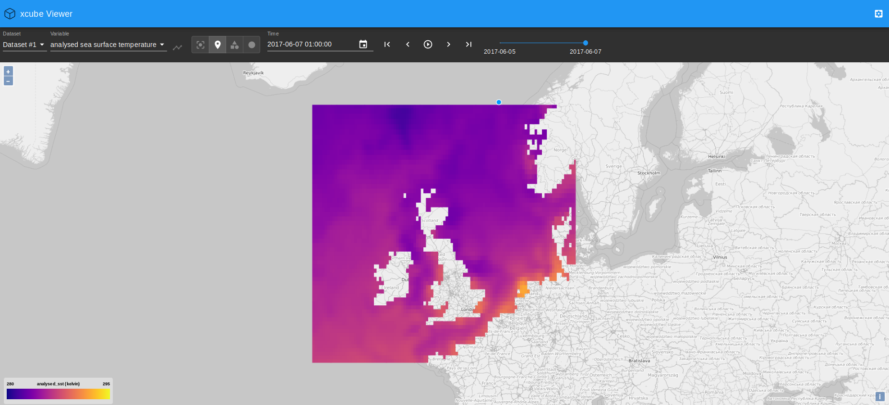

.. _xcube-viewer: https://github.com/dcs4cop/xcube-viewer/
.. _yarn: https://yarnpkg.com/lang/en/
.. _colormaps provided by matplotlib: https://matplotlib.org/examples/color/colormaps_reference.html
.. _Cesium Demo: http://localhost:9090/examples/serve/demo/index-cesium.html
.. _download Cesium: https://cesiumjs.org/downloads/
.. _demo's HTML file: https://github.com/dcs4cop/xcube/blob/master/examples/serve/demo/index-cesium.html

.. warning:: This chapter is a work in progress and currently less than a draft.

=========================
Publishing xcube datasets
=========================

This example demonstrates how to run an xcube server to publish existing xcube datasets.

Running the server
==================

To run the server on default port 8080 using the demo configuration:

::

    $ xcube serve --verbose -c examples/serve/demo/config.yml

To run the server using a particular xcube dataset path and styling information for a variable:

::

    $ xcube serve --styles conc_chl=(0,20,"viridis") examples/serve/demo/cube-1-250-250.zarr

Test it
=======

After starting the server, you can check the various functions provided by xcube Web API. To explore the functions, open
``<base-url>/openapi.html``.

xcube Viewer
============

xcube datasets published through ``xcube serve`` can be visualised using the `xcube-viewer`_ web application.
To do so, run ``xcube serve`` with the ``--open-viewer`` flag.

In order make this option usable, xcube-viewer must be installed and build:

1. Download and install `yarn`_.

2. Download and build xcube-viewer:

::

    $ git clone https://github.com/dcs4cop/xcube-viewer.git
    $ cd xcube-viewer
    $ yarn install
    $ yarn build

3. Configure ``xcube serve`` so it finds the xcube-viewer
   On Linux (please adjust path):

::

    $ export XCUBE_VIEWER_PATH=/abs/path/to/xcube-viewer/build

   On Windows (please adjust path):

::

    > SET XCUBE_VIEWER_PATH=/abs/path/to/xcube-viewer/build

4. Then run ``xcube serve --open-viewer``:

::

    $ xcube serve --open-viewer --styles conc_chl=(0,20,"viridis") examples/serve/demo/cube-1-250-250.zarr

Viewing the generated xcube dataset described in the example :doc:`xcube_gen`:

::

    $ xcube serve --open-viewer --styles "analysed_sst=(280,290,'plasma')" demo_SST_xcube-optimized.zarr

In case you get an error message "cannot reach server" on the very bottom of the web app's main window,
refresh the page.

You can play around with the value range displayed in the viewer, here it is set to min=280K and max=290K.
The colormap used for mapping can be modified as well and the
`colormaps provided by matplotlib`_ can be used.

Other clients
=============

There are example HTML pages for some tile server clients. They need to be run in
a web server. If you don't have one, you can use Node's ``httpserver``:

::

    $ npm install -g httpserver

After starting both the xcube server and web server, e.g. on port 9090:

::

    $ httpserver -d -p 9090

you can run the client demos by following their links given below.

OpenLayers
----------

* `OpenLayers 4 Demo <http://localhost:9090/examples/serve/demo/index-ol4.html>`_
* `OpenLayers 4 Demo with WMTS <http://localhost:9090/examples/serve/demo/index-ol4-wmts.html>`_

Cesium
------

To run the `Cesium Demo`_ first
`download Cesium`_ and unpack the zip
into the ``xcube serve`` source directory so that there exists an
``./Cesium-x.y.z`` sub-directory. You may have to adapt the Cesium version number
in the `demo's HTML file`_.

