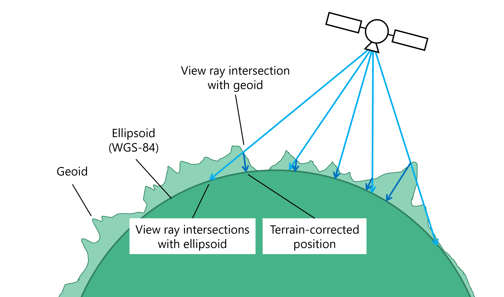

# Spatial Rectification Algorithm

This chapter describes the algorithm used in the function [`rectify_dataset()`](api.html#xcube.core.resampling.rectify_dataset) 
of module `xcube.core.resampling`. The function geometrically transforms 
spatial [data variables](https://docs.xarray.dev/en/stable/user-guide/terminology.html#term-Variable) 
of a given [dataset](https://docs.xarray.dev/en/stable/user-guide/terminology.html#term-Dataset) 
from an irregular source 
[grid mapping](https://cfconventions.org/Data/cf-conventions/cf-conventions-1.11/cf-conventions.html#grid-mappings-and-projections) 
into new data variables for a given regular target grid mapping and returns 
them as a new dataset. 

## Problem Description

The following figure shows a Sentinel-3 OLCI Level-1b scene in its original 
satellite perspective. In addition to the measured reflectances, the data 
product also provides the latitude and longitude for each pixel as two 
individual coordinate images. To the right, the absolute value of the 
gradient vectors  of the latitude and longitude  *|(∇ lon)² + (∇ lat)²|* 
are shown:  

<!--  -->

The given coordinates, latitude and longitude, are _terrain corrected_ with 
respect to a digital elevation model (DEM) that represents the Earth's geoid.
Therefore, the gradient vectors are not monotonically varying over the scene, 
instead they represent the roughness of the geoid surface. Areas of high 
surface roughness are indicated by the red circles in the figure above.
The figure below should explain the cause of the effect. 

<!--  -->

A _rectification_ is the transformation of satellite imagery from its original 
viewing geometry into a target geometry that forms a regular grid in a defined 
coordinate reference system (CRS) with uniform spatial resolution for each 
pixel in each dimension. For the Sentinel-3 OLCI Level-1b scene above, the
rectified measurement image for the geographic projection (CRS EPSG:4326) 
is shown here:

<!--  -->

## Algorithm Description

The input to the rectification algorithm is satellite imagery in satellite 
viewing perspective. In addition, two images – one for each spatial 
dimension – provide the terrain corrected spatial coordinates.
Thus, for each source pixel we have a given spatial coordinate pair *x,y*,
which is assumed to refer to a source image pixel's center at *i+½,j+½*. 
The expected algorithm input is:

* *N* source measurement images;
* *2* source coordinate images (one for each spatial dimension) 
  comprising terrain corrected coordinates *x,y* in units of the CRS
  for each pixel *i,j*;

The output produced by the algorithm is 

* *N* target measurement images generated from source measurement images
  by projection.
* Target image geometry given as pixel size *Δx=Δy* and the coordinate 
  offset of the upper left target image pixel *x0,y0*. Pixel size and 
  offsets are given in units of the CRS.    
* *2* target lookup images (one for each spatial dimension) 
  comprising fractional source pixel coordinates *i+½+u*, *j+½+v* 
  (explained below);

In the following, the CRS of the target and source is assumed to be the same.

While the gradient of the coordinate images, *Δx* and *Δy* per pixel, is 
generally not constant in the source image geometry, we demand that the
target pixel size *Δx = Δy = const* for all pixels in the generated target 
images.

A fast and simple algorithm to perform the rectification is to visit each
source pixel *i,j*, collect the spatial coordinates *P = x,y*, span
two triangles between four adjacent coordinates,
*(P1, P2, P3)* and *(P2, P4, P3)*, and "paint" fractional source pixel
coordinates into a new target lookup image. The lookup image can than be used 
to retrieve the source pixel values for a target image, either by nearest 
neighbor lookup or by interpolation. 

<!--  -->

The true geoid surface is fractal, hence there is no defined "best guess" for 
any point *P(i+u, j+v)* with *0 ≤ u ≤ 1, 0 ≤ v ≤ 1* in between the given coordinates 
points at *P(i+½, j+½)*. Hence, we use triangulation for its simplicity so 
that any in-between *P* is found by linear interpolation.

From the coordinates *(P1, P2, P3)* of the first source triangle, the bounding
box in pixel coordinates in the target image can be exactly determined, 
because the target grid is regular, *P = x0 + i Δx, y0 - j Δy*, for each 
target pixel *i,j*, target pixel size *Δx,Δy*, and *x0,y0* being the 
coordinates of the upper left pixel at *i=½,j=½*. Given *P* and the plane
given by *(P1, P2, P3)* the parameters *u,v* can be computed according to
*P = P1 + u (P2 – P1) + v (P3 – P1)*. 
If *0 ≤ u ≤ 1, 0 ≤ u ≤ 1, u+v ≤ 1*, then *P* is a point within the 
triangle. 

<!--  -->

At the same time, *u* and *v* are the fractions of source pixel
coordinate, *i + ½ + u* and *j + ½ + v*, which will be both stored in two 
target lookup images.

<!--  -->

After all source pixels have been processed, the resulting target lookup 
images containing the fractional source pixel indexes, *i + ½ + u* 
and *j + ½ + v*, can be used to efficiently map a source measurement image 
*V* into the target measurement image. The pixel values of the source
measurement image are given as *V1 = V(i, j)*, *V2 = V(i+1, j)*,
*V3 = V(i ,j+1)*, and *V4 = V(i+1, j+1)* here and
are represented by different colour values, e.g., measurements such 
as radiances or reflectances:

<!--  -->

In the simplest case, as shown above, a nearest neighbor lookup is performed 
to determine the pixel value *V* for the target measurement image according 
to:

*V = V2 if u > ½; V3 if v > ½; V1 else*  

The fractions *u,v* can also be used to perform a linear interpolation 
between the three adjacent source measurements pixels that formed
the original triangle:

*V = VA + u (V2 − V1) + u (V3 − V1)*  

Using bilinear interpolation between the four adjacent source 
measurements pixels:

*V = VA + v (VB − VA)*  

with

*VA = V1 + u (V2 − V1)*  
*VB = V3 + u (V4 − V3)* 
